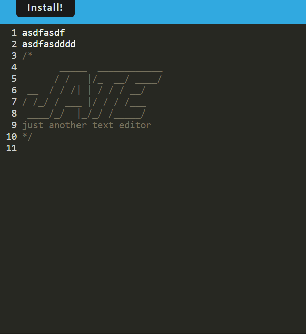

# J.A.T.E (Just Another Text Editor)

## Technology Used
- javascript
- node js
- webpack

## Description 
This is a product of a challenge provided by UC Berkeley Extension Coding Bootcamp

This is just another text editor that allows you to edit texts and save it in your local browser database
You can also install 

## Table of Contents

* [Installation](#installation)
* [Usage](#usage)
* [Learning Points](#learning-points)
* [Credits](#credits)
* [License](#license)

## Installation

click the install button on top left

## Usage 

Following is the demo of this app. The user can add, delete and update lines in texts.

## Learning Points
1. Using webpack configuration
2. Setting local browser database on client side

## Credits

### June Moon
- Email: moonjunsain@gmail.com
- [Github](https://github.com/moonjunsain)
- [Linkedin](https://www.linkedin.com/in/june-moon-940538280/)

## License

MIT License

---

© 2023 edX Boot Camps LLC. Confidential and Proprietary. All Rights Reserved.